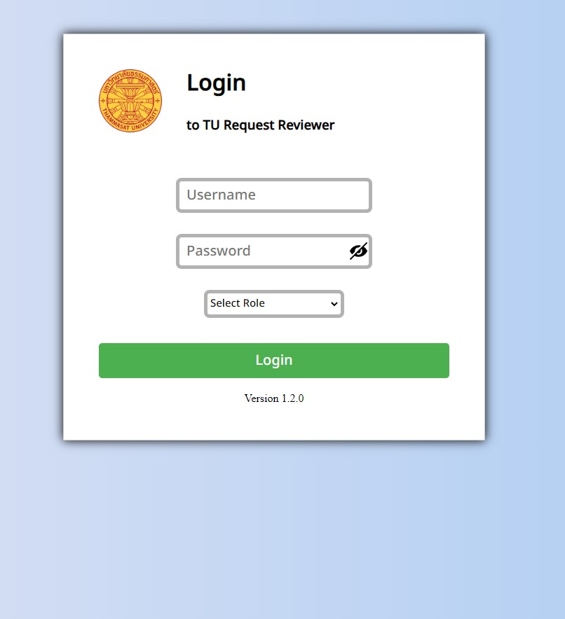
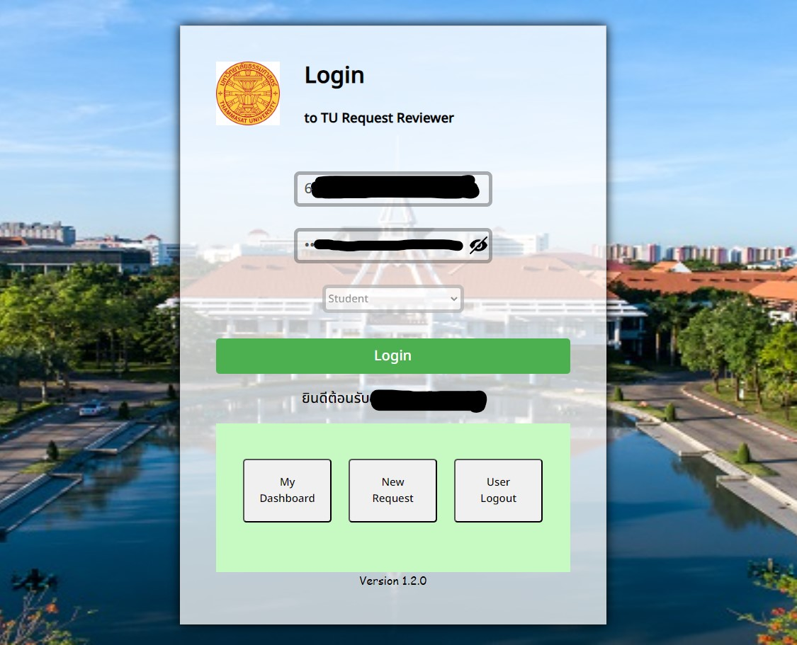

# TU Request Form Login Website



## This is a login page for CS261 Project "Online Request Form"

## Attention! You must be the student or the employee of the Thammasart University to use this service only!

### Features :
* Check Error in Username and Password Field (Empty)
* Check user roles that correspond to the **User Credential type**
* Every User Roles have a different permission
* Use TU-API Credential to validate the data

* Picture When Login successfully


### Testing on localhost :
1. clone or download this github repositry (universe : main)
2. open the directory 
`$\Frontend\public`
3. locate the directory 
`$\js`
4. edit the blank Application-Key to your own
if you don't have those key. you can get from https://restapi.tu.ac.th/home/
5. Up to the public directory
6. You can test run on index.html

### Hosting on NodeJS via Docker Container : 
1. Download Docker Desktop : https://desktop.docker.com/win/main/amd64/Docker%20Desktop%20Installer.exe?utm_source=docker&utm_medium=webreferral&utm_campaign=dd-smartbutton&utm_location=module
2. Installing the Docker Desktop
3. Important ! 
 * Search the program "Turn Windows features on or off"
 * Find the checkbox "Virtual Machine Platform" if it not checking please check this check box
 * Press OK and Restart the machine
4. Open the Command line and then go to directory 
 `$\Frontend`
5. Check Docker by typing 
```
docker --version
```
if it return `Docker version xxx, build yyy` you successfully install docker

6. Creating new network node

7. Build the file by running this code
```
docker build -f DockerContainer_NodeJS.dockerfile -t node-js-image .
docker run -d --name node-js --network mynetwork -p 3000:3000 node-js-image
```
8. Go to `localhost:3000` then the website will work in the localhost

* You can stop or run container in docker desktop application

Version 0.1.2


